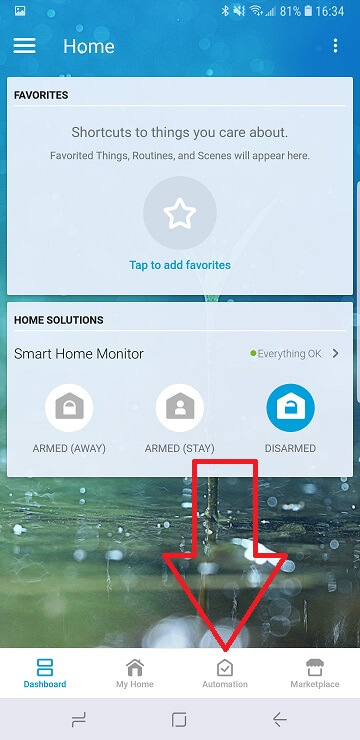
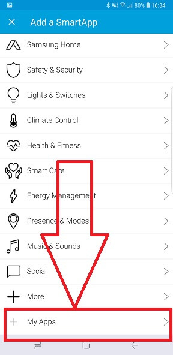
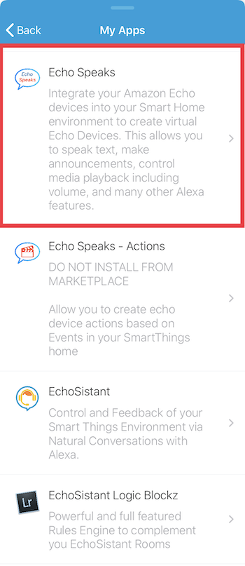
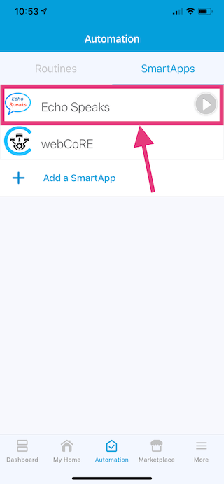
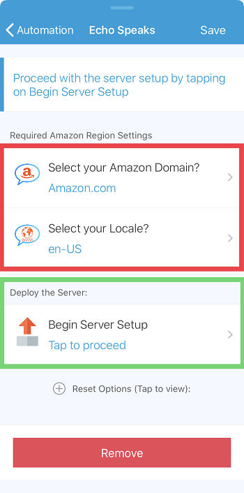

### <h3 style="color: #FF6025;">Step 1:</h3>
On your mobile device, open the SmartThings Classic App.
Tap on the **Automation** tab.

---
### <h3 style="color: #FF6025;">Step 2:</h3>
Scroll to the bottom of the screen and tap on **+ Add a SmartApp**

---
### <h3 style="color: #FF6025;">Step 3:</h3>
Scroll to the bottom of the screen again and tap on **+ My Apps**.

---
### <h3 style="color: #FF6025;">Step 4:</h3>
Scroll until you find **Echo Speaks** and tap on it to start the install process.

---
### <h3 style="color: #FF6025;">Step 5:</h3>
You will now be in the main screen of the Echo Speaks SmartApp.

* Review the available options and enable any items you wish to activate.
* Tap on the **Save/Done** button in the top right corner of the screen to complete the initial app install.

 

---
### <h3 style="color: #FF6025;">Step 6:</h3>
This will return you to the installed Apps page.

* Tap on **Echo Speaks** to begin server deployment.

    

---
### <h3 style="color: #FF6025;">Step 7:</h3>
You will be returned to the Server config page

---
### <h3 style="color: #FF6025;">Step 8:</h3>
Continue Server Config Here: <u>[Server Configuration](/echo-speaks-docs/configuration/smartthings/config_server)</u>
