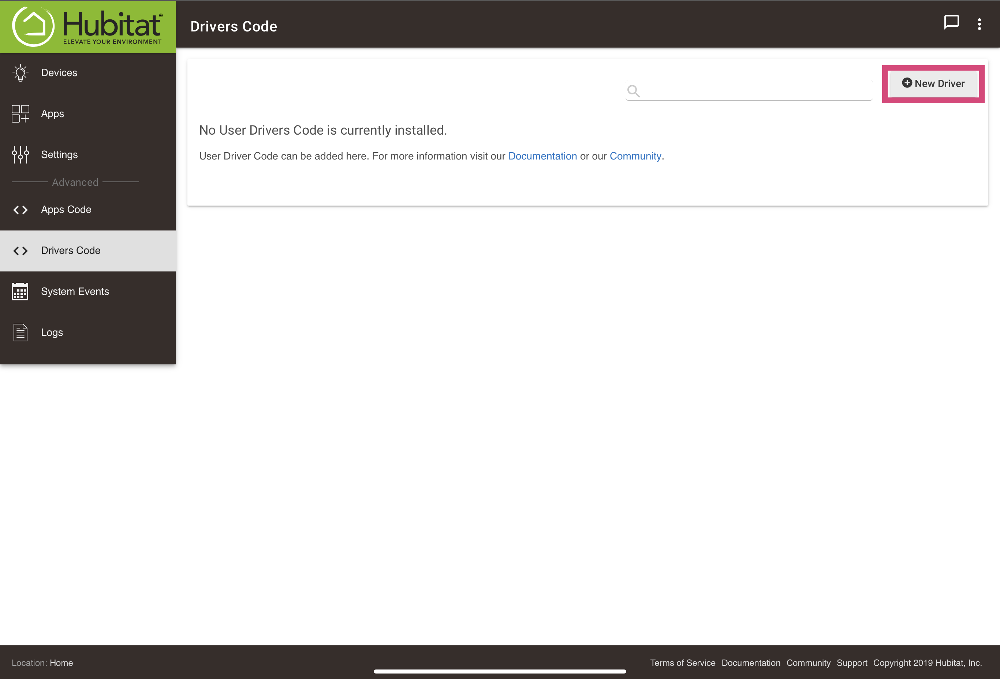
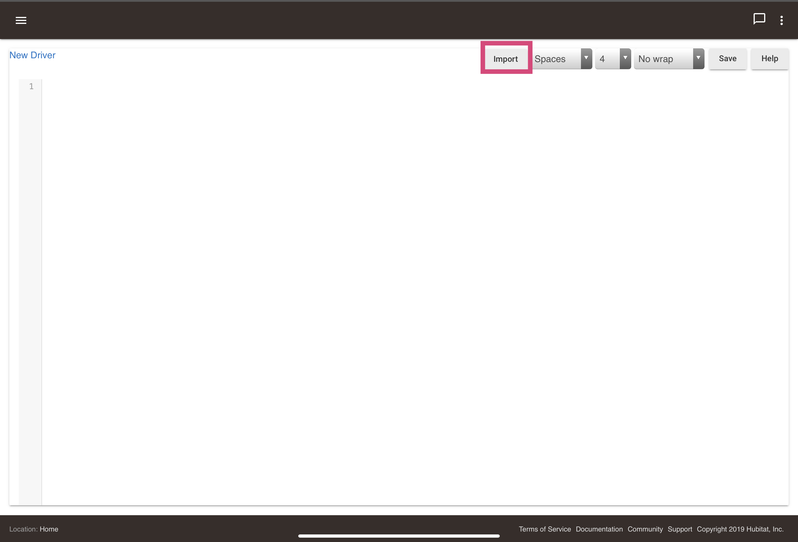
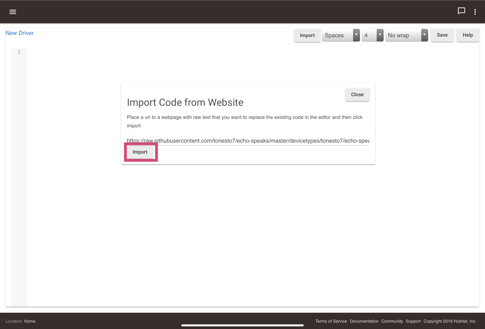

### <h3 style="color: #FF6025;">Step 1:</h3>

* Click on the **`Drivers Code`** tab:

    

---
### <h3 style="color: #FF6025;">Step 2:</h3>

* Create a new Driver by clicking on **`+New Driver`**:

    

---
### <h3 style="color: #FF6025;">Step 3:</h3>
Click on the `Import` button at the top of the page:

---
### <h3 style="color: #FF6025;">Step 4:</h3>:

* Copy this URL into the window: `https://raw.githubusercontent.com/tonesto7/echo-speaks/master/devicetypes/tonesto7/echo-speaks-device.src/echo-speaks-device.groovy`

  

* Click `Import`
* Click `Save`

### <h3 style="color: #FF6025;">Step 5:</h3>:

* Repeat Steps 1-4 for the Web Socket Driver: `https://raw.githubusercontent.com/tonesto7/echo-speaks/master/drivers/echo-speaks-ws.groovy`

* Click `Import`
* Click `Save`

---
### <h3 style="color: #FF6025;">Step 6:</h3>
Continue App Configuration Here:

[SmartApp Configuration](/echo-speaks-docs/configuration/hubitat/config_app)
