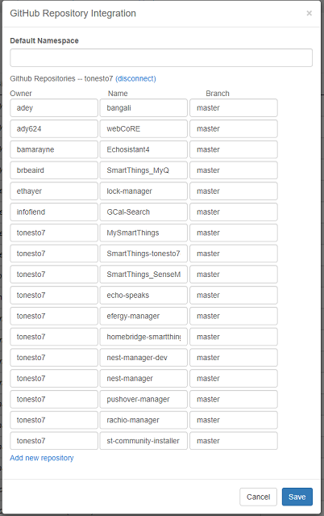
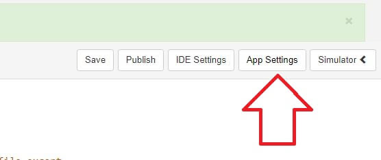
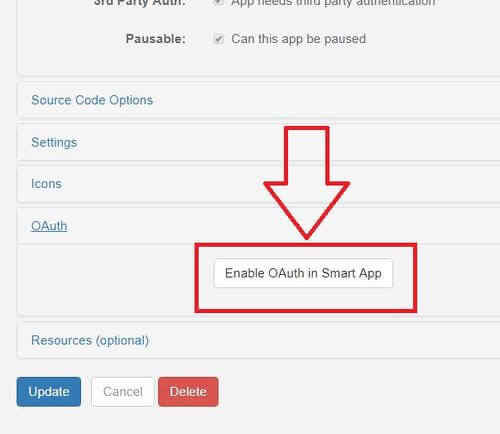

*Enabling the GitHub Integration in the IDE is by far the second easiest way to install and get the latest updates for Echo Speaks Apps and devices.*

 
## Add GitHub Repo to IDE

---
### <h3 style="color: #FF6025;">Step 1:</h3>
If you haven't enabled Git integration (one time configuration) under the IDE please visit here for instructions: ***[IDE GitHub Integration Instructions](http://docs.smartthings.com/en/latest/tools-and-ide/github-integration.html)***

**NOTE: Git Integration is not currently available outside of US and UK**

Otherwise Move to Step 2.

---
### <h3 style="color: #FF6025;">Step 2:</h3>
First, click on the **`Settings`** button at the top of SmartThings IDE page (this will only appear after completing the one-time integration with GitHub)

---
### <h3 style="color: #FF6025;">Step 3:</h3>

* Click on `Add new repository`

    

* Enter the information below:

    

    | **Owner** | **Name**    | **Branch** |
    | :-------- | :---------- | :--------- |
    | tonesto7  | echo-speaks | master     |

---
### <h3 style="color: #FF6025;">Step 4:</h3>

* Click on `Save` to close the GitHub Repository Integration page.

---

 
## SmartApp Code Install

### <h3 style="color: #FF6025;">Step 1:</h3>

* Click the **`My SmartApps`** button at the top of the IDE
    

* Click the **`Update from Repo`** button at the upper-right corner of the IDE
    

* Click on `echo-speaks (master)` from the drop down menu.
* On the right-hand column labelled New (Only in Github), scroll down to click the app to install.
* This will be:
  `echo-speaks.groovy`
  `echo-speaks-actions.groovy`
  `echo-speaks-zones.groovy`

* Check the Publish box and Click the `Execute Update` in the bottom-right corner of the screen.
* When it's completed syncing, the new app should now appear in the IDE. If they ever change color, that indicates a new version is available.

---
### <h3 style="color: #FF6025;">Step 2:</h3>
You will now enable the SmartApps OAuth configuration. Please click on the **`App Settings`** button and scroll to the bottom of the next screen.

---
### <h3 style="color: #FF6025;">Step 3:</h3>
Click on the **OAuth** tab and then click the **`Enable OAuth in Smart App`** button as seen below:

---
### <h3 style="color: #FF6025;">Step 4:</h3>
Finally, click on **`Update`**.

 
## Device Code Install

---
### <h3 style="color: #FF6025;">Step 1:</h3>

* Click the **`My Device Handlers`** button at the top of the IDE

    

* Click the **`Update from Repo`** button at the upper-right corner of the IDE

    

* Click on `echo-speaks (master)` from the drop down menu.
* On the right-hand column labelled New (Only in Github), scroll down to click the app to install.
* This will be:
  `echo-speaks-device.groovy`

* Check the Publish box and Click the `Execute Update` in the bottom-right corner of the screen.
* When it's completed syncing, the new device should now appear in the IDE. If they ever change color, that indicates a new version is available.

---
### <h3 style="color: #FF6025;">Step 4:</h3>
Continue SmartApp Configuration Here:

[SmartApp Configuration](/echo-speaks-docs/configuration/smartthings/config_app)
